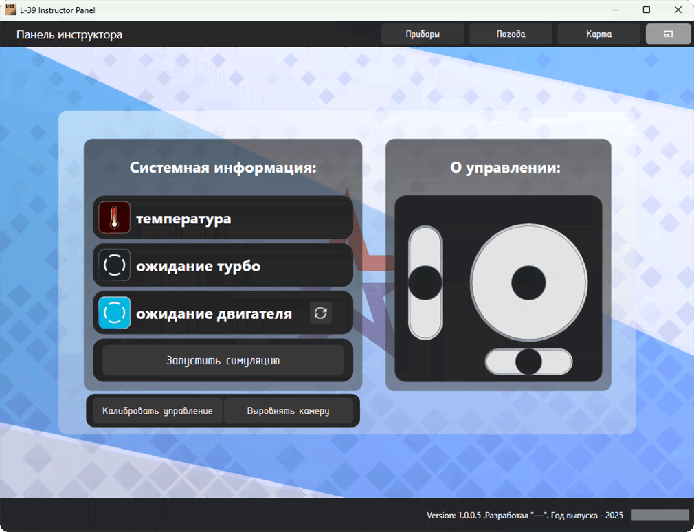
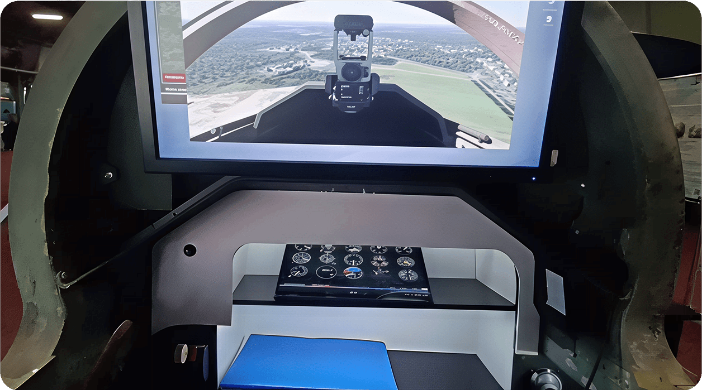

# Flight Simulator Instructor Shell

> [!NOTE]
>
> This program is one of the components of the aviation procedural simulator system designed for flight training.

  

# Preview

The program communicates via a local network between several automated workstations, each of which has special software for reading data from the cockpit controls, as well as software for flight modeling and graphical output of the simulation.

The instructor controls the student's flight using a specially designed instructor panel.

  

# About functionality

The software functionality includes:

* weather conditions management in the simulation;
* reading and outputting data from the flight simulator cockpit controls;
* displaying the current aircraft location on the map.

