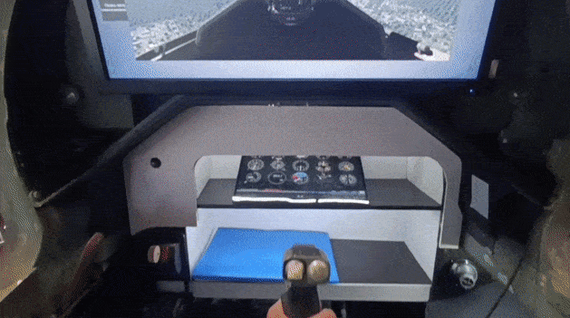

# Flight Simulator Instructor Shell

|  |  |  |  |  |
| :----------------------------------------------------------: | :----------------------------------------------------------: | :----------------------------------------------------------: | :----------------------------------------------------------: | :----------------------------------------------------------: |

----------------------------------------

  

> [!NOTE]
>
> This program is one of the components of the aviation procedural simulator system designed for flight training.

----------------------------------------

  

----------------------------------------
# About Project

| .NET Version |     Target      | Size  |
| :----------: | :-------------: | :---: |
|    net9.0    | Windows 32x\64x | 265mb |

# Preview

The program communicates via a local network between several automated workstations, each of which has special software for reading data from the cockpit controls, as well as software for flight modeling and graphical output of the simulation.

The instructor controls the student's flight using a specially designed instructor panel.

----------------------------------------

  

----------------------------------------

# About Functionality

> [!WARNING]
>
> This repository only contains a portion of the system. Full functionality cannot be published.

The software functionality includes:

* Weather conditions management in the simulation;
* Reading and outputting data from the flight simulator cockpit controls;
* Displaying the current aircraft location on the map;
* Duplicating the program and its functionality on a third-party device using Wi-Fi;
* Display of the aircraft instrument panel;
* Flight recording and objective flight control output in Excel format.

